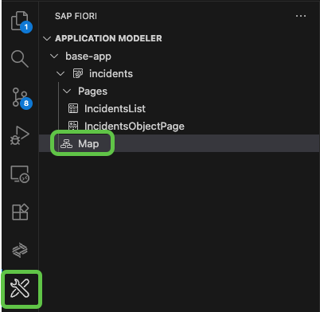
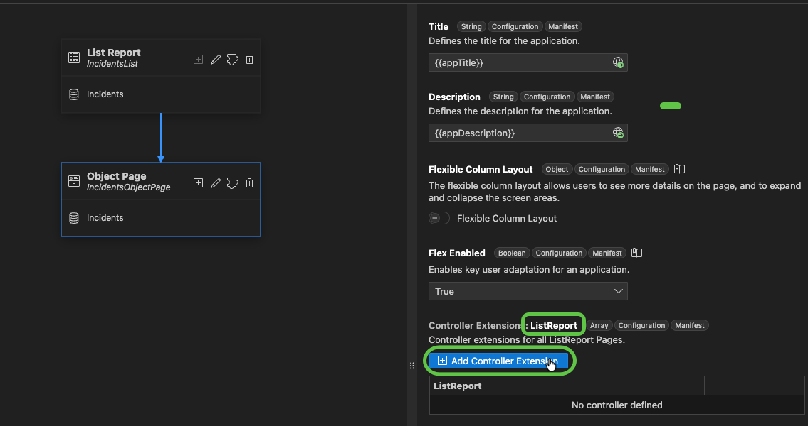
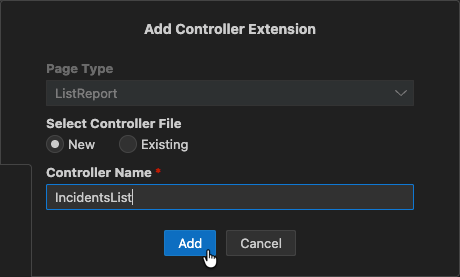
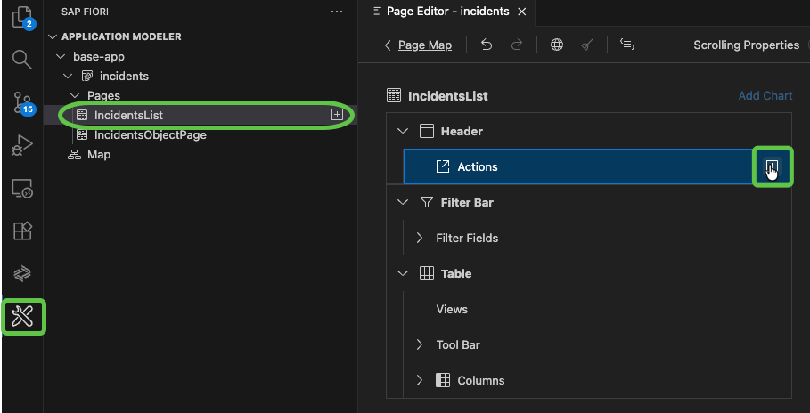
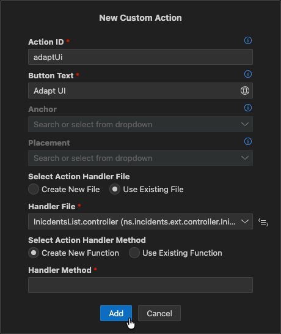

# Exercise 1 - Exercise 1 Description

In this exercise, we will use key user extensibility in order to add an already existing field to the Fiori Elements UI.

## Exercise 1.1 Run the application

### Have a quick look at the base app

As the basis for our exercise, we use the Incident Management application. Let's have a quick look at it!

#### The domain model
Open `base-app/db/schema.cds`. Here we find the domain model of the application.

The `Incidents` entity represents incidents created by customers, with fields for customer, title, urgency, status, and a composition of many conversations. Each conversation has an ID, timestamp, author, and message.

`Customers` can create support incidents. It includes fields for ID, first name, last name, e-mail, phone, credit card number, and a composition of many `Addresses`. The name field is calculated from the firstName and lastName fields. Elements can be specified with a calculation expression, in which you can refer to other elements of the same entity.

The Status and Urgency entities represent the status and urgency of incidents. Both are of type CodeList making it easy to use them as value helps.

The aspects `cuid` and `managed` from `@sap/cds/common` are used, which provided commonly needed fields with some underlying functionality. The `cuid` feature provides a unique identifier for an entity, while managed adds common administrative fields such as `createdAt` and `createdBy`.


#### Services
Open `base-app/srv/processor-service.cds`. Here we find one of the services of our application.

We define, what parts of the domain model should be exposed to the outside world, by default via OData. It's a great place to expose a service model, that actually fits our use case, with only the fields and entities needed for the specific use case. And to define who can create, update or delete the service entities.
Here, our incident processors only have direct access to the `Incidents`, but they can also reach e.g. `Customers`, as there is an association and the `@autoexpose` feature is activated.

There is another service in `base-app/srv/admin-service.cds`. Admins are allowed to create, update or delete the customers entity. A role `admin` is required to access this service.

#### Applications
The very simple domain and service model is enough to provide a full running CAP application including the database and the server. On top of this, we have defined a `Fiori Elements UI`. This can be found in `base-app/app/incidents`. In `base-app/app/incidents/annotations.cds` you will find the annotations needed to define the application.


#### Predefined extension fields
The predefined extension fields are provided through a plugin, which you can find in `./predefined-ext-fields-plugin`. The implementation is in the `cds-plugin.js` file.
It looks for `entities` in the CAP data model, which have an annotation `@extensible` and adds a set of predefined fields to them.
As we annotated the entity `Customers` in `base-app/db/schema.cds` with `@extensible`:
```cds
entity Customers @(extensible) : managed {
  key ID         : String;
  firstName      : String;
...
}
```
and added the plugin as a dependency in our `package.json`:
```json
 "dependencies": {
    ...
    "predefined-ext-fields-plugin": "file:./predefined-ext-fields-plugin"
  },
```
the fields are included.


So let's go ahead and try the application:


In a terminal window, execute the cds watch command. This will start your application locally.

```shell
cds watch base-app
```

In the section `Web Applications` click on `/incidents/webapp`.
Click on one of the incidents in the table to see the incident details.
Click on edit to edit the incident and save the changed incident.

With a very simple data model and service definition we have a fully running application.

Now let's have a look at the extension fields.
Navigate back to the Welcome index page (http://localhost:4004/)

In the section `Service Endpoints` under `/odata/v4/admin` click on `Customers`.
You can see the predefined extension fields, such as `predef_field_1`, `predef_field_2`, and `predef_field_3`, listed for each customer.

## Exercise 1.2 Key User and Personalization Enablement

Key users are end users entitled to adapt the application at runtime for their use case. They can work in a development system or the productive system in a running application without the need to know coding or entering an IDE.
The enablement itself requires a proper system setup:
* Having a storage for the adpatation (as well as personalization)
* Allow the user to acutally enter the mode in which the key user can make the needed changes

The storage is strongly dependent on the Setup.
While on major SAP setups, this storage is already included, customer implementations may need to setup and configure this on their own.

> [!NOTE]
> While multiple major scenarios of SAP are mentioned Multiple scenarios are mentioned to provide you with the insights for your scenarios. 
> SAP and customer BTP CF offerings provide the key user capabilities by making use of the SAPUI5 flexibility for key users service. How it is done is shown in this exercise.

All productive usage implementations of this storage requires a specific role to entitle a user to change the UI for other users while an authorized user is suficcient to personalize the application (i.e. filter or table personalization).

<details>

<summary>ABAP</summary>

In ABAP the Fiori Launchpad makes use of the layered repository (LRep) where it stores all related data.

An authorization for the key user is done by the role `SAP_UI_FLEX_KEY_USER`.

</details>

<details>

<summary>Cloud Foundry - Portal service</summary>

> [!WARNING]
> The portal sevice is deprecated.

While the portal service allows personalization, key user capability has to be added by the customer via the SAPUI5 flexibility for key users service.

</details>

<details>

<summary>Cloud Foundry - Work Zone</summary>

The work zone service makes use of the SAPUI5 flexibility for key users service. All configuration is done for personalization. Key user functionality is enabled by default for new sites and can be enabled for sites created prior to July 2025 by enabling "Key User Adaptation".

An authorization for the key user is done by the role `FlexKeyUser`.

</details>

<details>

<summary>Cloud Foundry - Stand Alone</summary>

On the BTP CF stand alone application can also make use of SAPUI5 flexibility without relying on an integration within a Fiori Lauchnpad or Workzone service. To do so, the SAPUI5 flexibility for key users service can be used and must be bound as well as requests from clients have to be routed to it.

[!HINT] For a later read! The [product page](https://discovery-center.cloud.sap/serviceCatalog/ui5-flexibility-for-key-users) includes links to the service capabilities as well as developer docu.

An authorization for the key user is done by the role `FlexKeyUser`.

</details>

### Excercise 1.2.1 Define the Storage

The first step is keeping personalization as well as other adaptation stored.
In this exercise we aim for a BTP deployable application and thus use a service on the BTP CF.

* A storage can be defined by adding the parameter `data-sap-ui-flexibilityServices='[{"connector":"BtpServiceConnector", "url": "/my/flex/url"}]'` to the ui5 bootstrap of SAPUI5 within the `index.html`.

```html
<script
  id="sap-ui-bootstrap"

  ...

  data-sap-ui-flexibilityServices='[{"connector":"BtpServiceConnector", "url": "/my/flex/url"}]'

  ...

></script>
```

This allows SAPUI5 to send the data to the correct endpoint.

[!HINT] The URL of the endpoint is defined by the rounting and has to match the route of the bound "SAPUI5 flexibility for key users" service.

[!WARNING] The correct configuration can be tested to use the `cds watch`, create a filter and which is then "save as". In the debugger an error is shown, that the writing failed with a 404. This is as expected, because the application is not deployed and no backend is available to receive the request.

While this allows a writing, getting the data on the early application startup also requires the `sap.ui.fl` library to be loaded.

* For this an additional lib dependency has to be added to the `manifest.json` under `"sap.ui5" > "dependencies" > "libs"` the following line: `"sap.ui.fl": {}`

```json
{
    
    ...

    "sap.ui5": {
        
        ...

        "dependencies": {
            
            ...

            "libs": {
                
                ...

                "sap.ui.fl": {}
            }
        },
        
        ...

    },
    
    ...

}

```

Now the application is ready to write data as well as retreive the data on an application startup.

### Excercise 1.2.2 Define the Test index.html

Now that the setup for a deployment is done, it is time to also test the introduced functionality local.

To allow this, SAPUI5 has to be instructed to use a different storage. Instead of sending a REST call to write or read content, the local storage can be used.

* Copy the `index.html`and name it `index_local.html`.

* Then adapt in the newly created file the `data-sap-ui-flexibilityServices` to `'[{"connector":"LocalSessionConnector"]'`.

* After the addition of the file, the localhost now shows another application.


* Open the application and again create a filter. This filter is now part of the local storage and is also persisted between sessions.

[!WARNING] This filter is not part of the development artifacts and will not be deployed. This is soley to test end user behavior and can be used for testing. To run different tests in parallel, the `SessionStorageConnector` is a better option.

### Excercise 1.2.3 Adding an Adapt UI button

Now that personalization and the storage is working, authorized end users can also adjust the UI to their companies needs.

This is done at runtime in a specific mode.

To enter this mode, the user needs an option to do so.

In this exercise we will add a button and add the needed conding to start this mode and tell it which part of the application is acual adapatble.

To add the button, we will use the Fiori tools.

* Click on the Fiori Tools icon.

First create a controller extension:

* Select in the `application modeler` the `Map`



* In the details press `Add controller extension` for the `ListReport`



* Provide the name `ListReport` and press `Add`



* Select in the `application modeler` the `IncidentsList`.

* Press the `+` button on the Header > Actions (visible only on hover)



* Add a new custom action with an `Action ID` called `adaptUi`, a button text `Adapt UI`, a `Handler File` select `Use Existing File` and within the drop down `IncidentsList.controller`. For a Action Handler create a new `Handler Method` called `onAdaptUi`. Afterwards confirm with `Add`.



[!HINT] In the running application now a Button is visible in the header, but pressing it will only show the predefined message.


* Change the method `onAdaptUi` in the `IncidentsList.controller.js` as well as add require needed modules:

```js
sap.ui.define([
	'sap/ui/core/Core',
	'sap/ui/core/Lib',
	'sap/ui/core/mvc/ControllerExtension'
], function (
	Core,
	Lib,
	ControllerExtension
) {

...

onAdaptUi: async function(oContext, aSelectedContexts) {
    await Lib.load({name: "sap.ui.rta"});
    sap.ui.require([
        "sap/ui/rta/api/startKeyUserAdaptation"
    ], (startKeyUserAdaptation) => {
        startKeyUserAdaptation({
            rootControl: Core.byId("ns.incidents::IncidentsList--fe::ListReport")
        })
    })
}
```

On a button press now the method will require the needed function to start the adaptation as well as name the root control `ns.incidents::IncidentsList--fe::ListReport` to create overlays which then will be clickable for the actions offered by the controls.

[!HINT] Now the key user functionality can be tested in the running application.


## Exercise 1.2.4 Configure the visibility

In the deployed application not every end user should have the possibility to adjust the UI for all other users. A specific role is required to do so, but the button is not yet configured to reflect this.

* To add a role check, change the `onInit` method of the `ListReport.controller.js`:

```js
onInit: function () {
  const oAdaptationButton = this.getView().byId("fe::CustomAction::adaptUi"); // must match the ID of the button
  FeaturesAPI.isKeyUser().then(function (bIsKeyUser) {
    console.log("key user is " + bIsKeyUser);
    oAdaptationButton.setVisible(bIsKeyUser);
  });
}
```

Now the code checks if the user has the role. To test this, open the `index.html` and check if the button is hidden. The backend call to determine the visibility resulted in an error (404) and therefore the method used in the controller extension was `false`.
After deployment, the role has to be assigned to get the control visible as well as allow writing of such changes within the storage.

[!HINT] The `localStorageConnector` has the flag always set to true and the button will be visible. With this setup, key user functionality can be tested.

## Exercise 1.3 Add & rename the field

In the application, there are already fields specified but not yet shown. Customers can use these fields and add them to the UI. In this step, test the userflow:

* Open the `index_local.html`, press the added `Adapt UI` button to start the adaptation

* Right click the table

* Select `View Settings`.

* Check the field `predef_field_1`

* Raise the field to the top (showing it first in the table)


Now the field is added as a visible element in the Table.


* Right click the table again

* Select `Change Labels`


* Change `predef_field_1` text


The field is renamed, but since all occurences of this bound field should be updated, a change was not done on the table itself but on the property which is only interpreted on creation.

* To reflect the changes press `Reload to View Changes`

If a key user is satisfied with the changes, the draft can be promoted to a version. This makes the changes available for all end users.

* Press `activate` (wand icon), provide a name and press `Confirm`.

[!HINT] This was an end to end flow test of the key user capabilties the application now posesses. All these adaptations done with `Adapt UI` is not part of the source code and will not be deployed.

## Summary

You've now added key user functionality like adding a field, which was made available in advance as a predefined extension field. Adding a field this way has the advantage of being able to update content without a redeployment to the database or even a restart of the CAP application, as the underlying data structure and CAP domain and service model do not change

Continue to - [Exercise 2 - Exercise 2 Description](../ex2/README.md)
