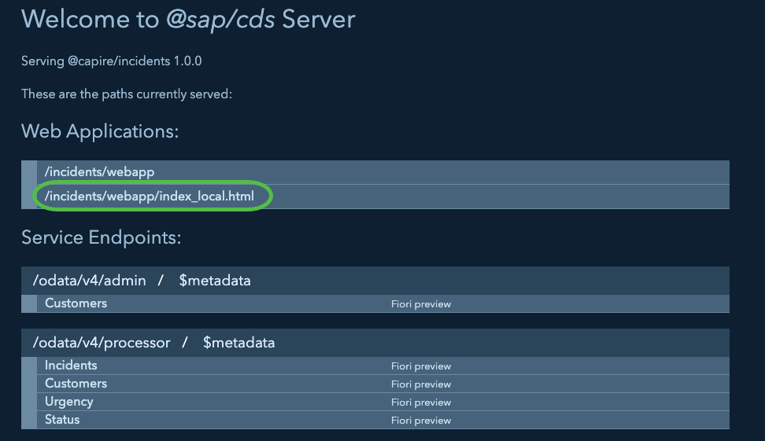
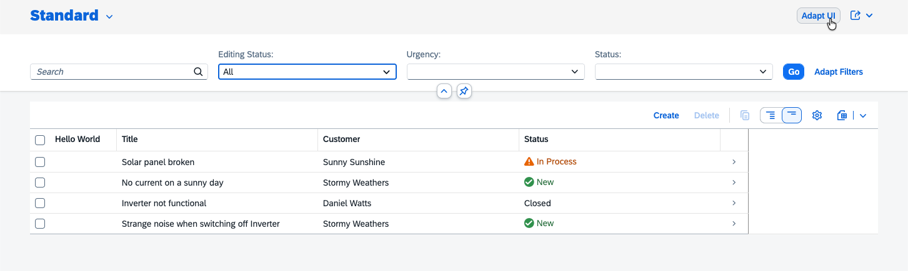
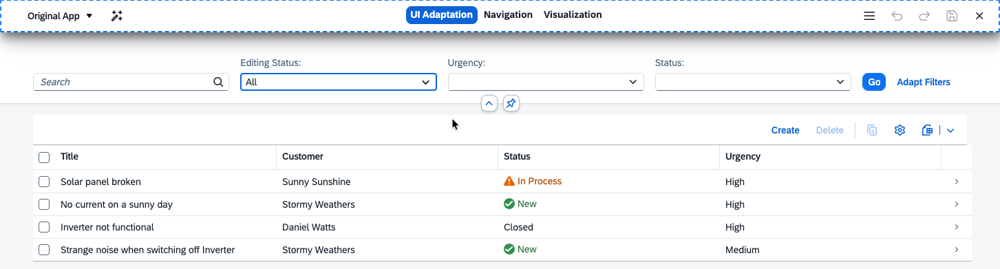

# Exercise 2 - Flexibility Personalization and Key User Functionality

In this exercise, we will use key user extensibility in order to add an already existing field to the Fiori Elements UI.

## Exercise 2.1 Key User and Personalization Enablement

Key users are end users entitled to adapt the application at runtime for their use case. They can work in a development system or the productive system in a running application without the need to know coding or entering an IDE.
The enablement itself requires a proper system setup:
* Having a storage for the adpatation (as well as personalization)
* Allow the user to acutally enter the mode in which the key user can make the needed changes

The storage is strongly dependent on the Setup.
While on major SAP setups, this storage is already included, customer implementations may need to setup and configure this on their own.

> [!NOTE]
> While multiple major scenarios of SAP are mentioned Multiple scenarios are mentioned to provide you with the insights for your scenarios. 
> SAP and customer BTP CF offerings provide the key user capabilities by making use of the SAPUI5 flexibility for key users service. How it is done is shown in this exercise.

All productive usage implementations of this storage requires a specific role to entitle a user to change the UI for other users while an authorized user is sufficient to personalize the application (i.e. filter or table personalization).

> [!WARNING]
> The SAP portal service on Neo landscapes will be removed.
> Instead of the SAP Cloud Portal service on BTP it is recommended to go with the SAP Work Zone service.
> Both options are only mentioned for readers already on this setup.

<details>

<summary>ABAP</summary>

In ABAP the Fiori Launchpad makes use of the layered repository (LRep) where it stores all related data.

An authorization for the key user is done by the role `SAP_UI_FLEX_KEY_USER`.

</details>

<details>

<summary>Neo - SAP Cloud Portal Service</summary>

The portal service makes use of a java implementation of the layered repository (LRep) and stores all related data similar to the ABAP setup.

This offering will be removed!

</details>

<details>

<summary>Cloud Foundry - SAP Cloud Portal Service</summary>

While the portal service allows personalization, key user capability has to be added by the customer via the SAPUI5 flexibility for key users service.

</details>

<details>

<summary>Cloud Foundry - Work Zone</summary>

The work zone service makes use of the SAPUI5 flexibility for key users service. All configuration is done for personalization. Key user functionality is enabled by default for new sites and can be enabled for sites created prior to July 2025 by enabling "Key User Adaptation".

An authorization for the key user is done by the role `FlexKeyUser`.

</details>

<details>

<summary>Cloud Foundry - Stand Alone</summary>

On the BTP CF stand alone application can also make use of SAPUI5 flexibility without relying on an integration within a Fiori Lauchnpad or Workzone service. To do so, the SAPUI5 flexibility for key users service can be used and must be bound as well as requests from clients have to be routed to it.

 ℹ️ For a later read! The [product page](https://discovery-center.cloud.sap/serviceCatalog/ui5-flexibility-for-key-users) includes links to the service capabilities as well as developer docu.

An authorization for the key user is done by the role `FlexKeyUser`.

</details>

### Excercise 2.1.1 Define the Storage

The first step is keeping personalization as well as other adaptation stored.
In this exercise we aim for a BTP deployable application and thus use a service on the BTP CF.

* A storage and the corresponding client side implementation can be defined by adding the parameter `data-sap-ui-flexibilityServices='[{"connector":"BtpServiceConnector", "url": "/my/flex/url"}]'` to the ui5 bootstrap of SAPUI5 within the `index.html`.

```html
<script
  id="sap-ui-bootstrap"

  ...

  data-sap-ui-flexibilityServices='[{"connector":"BtpServiceConnector", "url": "/my/flex/url"}]'

  ...

></script>
```

This allows SAPUI5 to send the data to the correct endpoint.

[!HINT] The URL of the endpoint is defined by the rounting and has to match the route of the bound "SAPUI5 flexibility for key users" service.

[!WARNING] The correct configuration can be tested to use the `cds watch`, create a filter and which is then "save as". In the debugger an error is shown, that the writing failed with a 404. This is as expected, because the application is not deployed and no backend is available to receive the request.

While this allows a writing, getting the data on the early application startup also requires the `sap.ui.fl` library to be loaded.

* For this an additional lib dependency has to be added to the `manifest.json` under `"sap.ui5" > "dependencies" > "libs"` the following line: `"sap.ui.fl": {}`

```json
{
    
    ...

    "sap.ui5": {
        
        ...

        "dependencies": {
            
            ...

            "libs": {
                
                ...

                "sap.ui.fl": {}
            }
        },
        
        ...

    },
    
    ...

}

```

Now the application is ready to write data as well as retreive the data on an application startup.

### Excercise 2.1.2 Define the Test index.html

Now that the setup for a deployment is done, it is time to also test the introduced functionality local.

To allow this, SAPUI5 has to be instructed to use a different storage. Instead of sending a REST call to write or read content, the browsers session storage can be used.

[!WARNING] The session storage is for (manual and automated) testing only! A session storage is not safe for productive usage. The stored data is clearly visible until the session is closed and can be accessed. 

* Copy the `index.html`and name it `index_local.html`.

* Then adapt in the newly created file the `data-sap-ui-flexibilityServices` to `'[{"connector":"SessionSessionConnector"]'`.

* After the addition of the file, the localhost now shows another application.



* Open the application and again create a filter. This filter is now part of the local storage and is also persisted between sessions.

[!WARNING] This filter is not part of the development artifacts and will not be deployed. This is soley to test end user behavior and can be used for testing. To run different tests in parallel, the `SessionStorageConnector` is a better option.

## Excercise 2.2 Adding an Adapt UI Functionality

Now that personalization and the storage is working, authorized end users can also adjust the UI to their companies needs.

This is done at runtime in a specific mode.

To enter this mode, the user needs an option to do so.

In this exercise we will add a button and add the needed conding to start this mode and tell it which part of the application is acual adapatble.

### 2.2.1 Adding the Adapt UI Button

To add the button, we will use the Fiori tools.

* Click on the Fiori Tools icon.

First create a controller extension:

* Select in the `application modeler` the `Map`


* In the details press `Add controller extension` for the `ListReport`


* Provide the name `ListReport` and press `Add`


* Select in the `application modeler` the `IncidentsList`.

* Press the `+` button on the Header > Actions (visible only on hover)


* Add a new custom action with an `Action ID` called `adaptUi`, a button text `Adapt UI`, a `Handler File` select `Use Existing File` and within the drop down `IncidentsList.controller`. For a Action Handler create a new `Handler Method` called `onAdaptUi`. Afterwards confirm with `Add`.


[!HINT] In the running application now a Button is visible in the header, but pressing it will only show the predefined message.



* Change the method `onAdaptUi` in the `IncidentsList.controller.js` as well as add require needed modules:

```js
sap.ui.define([
	'sap/ui/core/Core',
	'sap/ui/core/Lib',
	'sap/ui/core/mvc/ControllerExtension'
], function (
	Core,
	Lib,
	ControllerExtension
) {

...

onAdaptUi: async function(oContext, aSelectedContexts) {
    await Lib.load({name: "sap.ui.rta"});
    sap.ui.require([
        "sap/ui/rta/api/startKeyUserAdaptation"
    ], (startKeyUserAdaptation) => {
        startKeyUserAdaptation({
            rootControl: Core.byId("ns.incidents::IncidentsList--fe::ListReport")
        })
    })
}
```

On a button press now the method will require the needed function to start the adaptation as well as name the root control `ns.incidents::IncidentsList--fe::ListReport` to create overlays which then will be clickable for the actions offered by the controls.

[!HINT] Now the key user functionality can be tested in the running application.



### Exercise 2.2.2 Configure the visibility

In the deployed application not every end user should have the possibility to adjust the UI for all other users. A specific role is required to do so, but the button is not yet configured to reflect this.

* To add a role check, change the `onInit` method of the `ListReport.controller.js`:

```js
onInit: function () {
  const oAdaptationButton = this.getView().byId("fe::CustomAction::adaptUi"); // must match the ID of the button
  FeaturesAPI.isKeyUser().then(function (bIsKeyUser) {
    console.log("key user is " + bIsKeyUser);
    oAdaptationButton.setVisible(bIsKeyUser);
  });
}
```

Now the code checks if the user has the role. To test this, open the `index.html` and check if the button is hidden. The backend call to determine the visibility resulted in an error (404) and therefore the method used in the controller extension was `false`.
After deployment, the role has to be assigned to get the control visible as well as allow writing of such changes within the storage.

[!HINT] The `SessionStorageConnector` has the flag always set to true and the button will be visible. With this setup, key user functionality can be tested.

## Summary

You've now added key user functionality to allow customers adding these fields on demand without developer involvement, your product to provide a customer specific solution or decide which direction the product has to go.

Continue to - [Exercise 3 - Testing the Customer Flow](../ex3/README.md)
