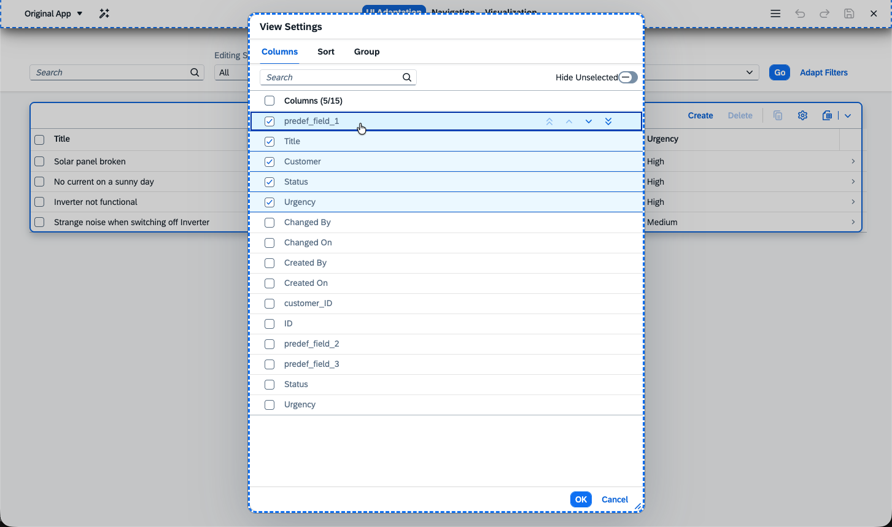
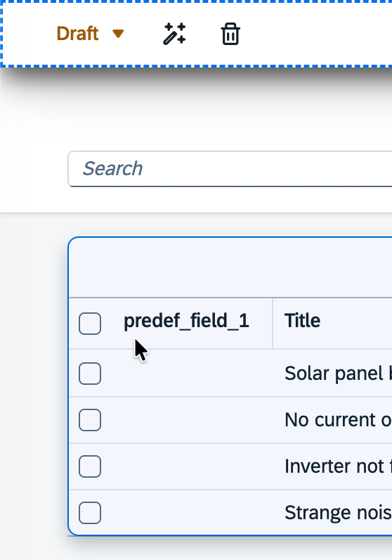
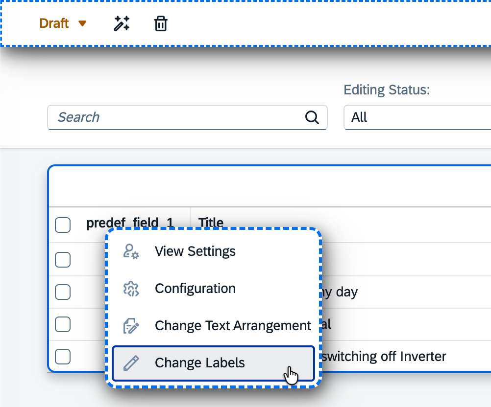

# Exercise 3 - Testing the Customer Flow

In this exercise, we will use key user extensibility in order to add an already existing field to the Fiori Elements UI.

## Exercise 3.1 Add & Rename the Field

In the application, there are already fields specified but not yet shown. Customers can use these fields and add them to the UI. In this step, test the userflow:

* Open the `index_local.html`, press the added `Adapt UI` button to start the adaptation

* Right click the table

* Select `View Settings`.

* Check the field `predef_field_1`

* Raise the field to the top (showing it first in the table)

Now the field is added as a visible element in the Table.

## Exercise 3.2 Rename the Field

* Right click the table again

* Select `Change Labels`

* Change `predef_field_1` text

The field is renamed, but since all occurrences of this bound field should be updated, a change was not done on the table itself but on the property which is only interpreted on creation.

* To reflect the changes press `Reload to View Changes`

## Exercise 3.3 Confirming the Changes

If a key user is satisfied with the changes, the draft can be promoted to a version. This makes the changes available for all end users.

* Press `activate` (wand icon), provide a name and press `Confirm`.

> [!HINT] This was an end-to-end flow test of the key user capabilities the application now possesses. All these adaptations done with `Adapt UI` are not part of the source code and will not be deployed.

## Summary

The flow is (manually) tested and you are familiar with the flow your end user will experience.

Continue to - [Exercise 4 - Creating the Extension](../ex4/README.md)
