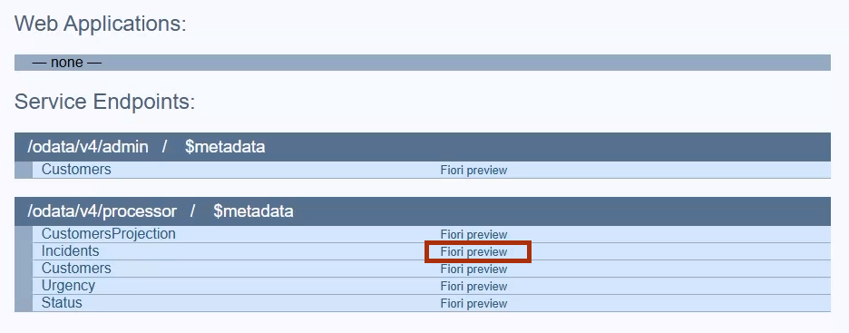

# Exercise 5 - Extending the Model

In this exercise, you will extend the data model with additional fields, UI annotations, and actions to create a more comprehensive extension.

## Prerequisites

- Completion of [Exercise 4](../ex4/README.md)
- Extension project `myExtension` created and base model pulled

## Learning Objectives

After completing this exercise, you will be able to:
- Extend entities with additional fields
- Create write-enabled projections for extended entities
- Add UI annotations for enhanced user experience
- Define bound actions for business logic
- Test extensions locally before pushing to base application

## Steps

### Step 1: Extend the Data Model

We already created a basic extension in the previous exercise. Now let's expand the `db/extension.cds` file to include more comprehensive extensions:

```cds
using {sap.capire.incidents as my} from '@capire/incidents';

extend my.Customers with {
  status : String(8) @title: 'Customer Status' default 'Silver';
};

extend service ProcessorService with {
  @cds.redirection.target: false
  entity CustomersProjection as
    projection on my.Customers {
      @readonly ID,
      @readonly name,
      status
    };
}

extend ProcessorService.Incidents with columns {
  @readonly customer.status as CustomerStatus
};
```

**What we're doing here:**
- The `Customers` entity gets an additional `status` attribute
- Since ProcessorService only has an autoexposed `Customers` entity (which is read-only), we create a write-enabled `CustomersProjection`
- We use `@readonly` annotations to expose minimal surface for writing (only `status` can be modified)
- We use `@cds.redirection.target: false` to clarify the redirection target for the `Customers` association
- We extend the `Incidents` projection to include the flattened customer status

### Step 2: Handle Test Data

1. Copy the `db/data` folder from the base incidents application to the `test/data` folder in your extension project:
   ```bash
   cp -r ../base-app/db/data ./test/
   ```

> **Note**: Initial data in `db/data` folder gets pushed with the extension and may overwrite production data. Test data in `test/data` folder is only used locally and is **not pushed** with the extension.

### Step 3: Enhance the UI

Add Fiori Elements annotations by copying this snippet to the end of your `db/extension.cds` file:

```cds
annotate ProcessorService.Incidents with @(UI : {
  LineItem                   : [
    ...,
    {
      Value         : urgency.descr,
      Criticality   : (urgency.code = 'H' ? 1 : (urgency.code = 'M' ? 2 : 0)),
      Label         : 'Urgency',
      @UI.Importance: #High
    },
    {
      Value            : CustomerStatus,
      Label            : 'Customer Status',
      ![@UI.Importance]: #High
    },
    {
      $Type : 'UI.DataFieldForAction',
      Action: 'ProcessorService.promoteCustomer(ProcessorService.Incidents)',
      Label : 'promote Customer',
    },
    {
      $Type : 'UI.DataFieldForAction',
      Action: 'ProcessorService.promoteIncident',
      Label : 'promote Incident',
    },
  ],
  FieldGroup #GeneratedGroup1: {Data: [..., {Value: CustomerStatus}]}
});
```

**What we're doing here:**
- Adding Customer Status to the Incidents list view via `LineItem`
- Using [delta annotations](https://cap.cloud.sap/docs/cds/cdl#extend-array-annotations) to extend array values
- Adding color coding to urgency via `Criticality` 
- Leveraging [expressions in annotations](https://cap.cloud.sap/docs/cds/cdl#expressions-as-annotation-values)
- Adding Customer Status to the object page using `FieldGroup`

### Step 4: Add Actions

Add the following actions by copying this snippet to the end of your `db/extension.cds` file:

```cds
extend ProcessorService.Incidents with actions {
  @(Common.SideEffects: {TargetEntities: ['/ProcessorService.EntityContainer/Incidents']})
  action promoteIncident();

  @(Common.SideEffects: {TargetEntities: ['/ProcessorService.EntityContainer/Incidents']})
  action promoteCustomer(in : many $self,
                         @(
                           title: 'promote Customer to Gold',
                           Common: {
                             ValueListWithFixedValues: true,
                             ValueList               : {
                               CollectionPath: 'CustomersProjection',
                               Parameters    : [
                                 {
                                   $Type            : 'Common.ValueListParameterInOut',
                                   ValueListProperty: 'ID',
                                   LocalDataProperty: Customer_ID
                                 },
                                 {
                                   $Type            : 'Common.ValueListParameterDisplayOnly',
                                   ValueListProperty: 'name'
                                 }
                               ]
                             }
                           }
                         )
                         Customer_ID : String);
};
```

**What we're doing here:**
- Both actions are **bound** to `ProcessorService.Incidents` from a CDS perspective
- `promoteIncident` is **entity bound** for Fiori Elements (works on selected incidents)
- `promoteCustomer` is **collection bound** and includes a value list for customer selection
- The annotations create the appropriate UI behavior for each action type

### Step 5: Test the Extension Locally

Instead of constantly pushing to the base application, you can test locally in single-tenant mode:

1. **Start the extension project locally**:
  In terminal 3, run the following:

   ```bash
   cds watch
   ```

2. **Open the application** at `http://localhost:4006` and under Service Endpoints > `/odata/v4/processor` > `Fiori Preview` next to Incidents

   - Navigate to the Incidents application
   - Verify the Customer Status column appears
   - Check that the action buttons are present:
     - `promote Customer` should show a selection dialog
     - `promote Incident` should be disabled until you select incidents

> **Note**: Local testing doesn't include business logic from the base application. For comprehensive testing, you may need to test against the actual base application.

### Step 6: Push the Complete Extension

Once you're satisfied with your changes:

```bash
cds push --to localhost:4005 -u bob:
```

## Summary

You have successfully extended the model with:
- Additional `status` field on Customers entity
- Write-enabled projection for customer status updates
- UI enhancements showing customer status in incidents
- Two action buttons for promoting customers and incidents
- Local testing capabilities for development

The extension demonstrates key extensibility patterns:
- Model extensions with new fields
- Service extensions with projections
- UI annotations for enhanced user experience
- Action definitions for business operations

Continue to - [Exercise 6 - Bound Actions](../ex6/README.md)